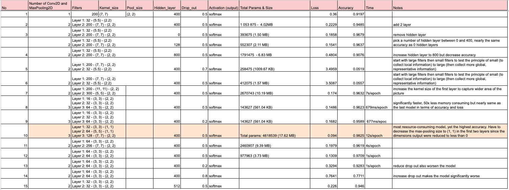

# Result Table

## Result Format Note

"Layer 1: 32 - (5.5) - (2.2)
Layer 2: 200 - (7, 7) - (2, 2)"

Filters - Kernel_size - Pool_size

# Conclusions

The project utilizes the German Traffic Sign Recognition Benchmark (GTSRB) with 43 classes of traffic signs with around 50000 images including training and testing.

I trained a total of 15 models, with the number of convolution layers ranging from 1 to 3, max_pool size including (1, 1) and (2, 2), number of filters from 16 - 32 - 64 - 256 to 300, hidden layers 400 and 512, drop out rate 0.2 -> 0.8. The size of my models range from 500KB to as large as 17.62MB.

I tested the principle of starting with a small filter to collect local information like corners, edges then bigger filters for more global features in subsequent layers as they combine local patterns to form bigger ones such as shapes. This principle turned out to be true, which I then utilized to reach my best model.

My best model is the heaviest model which has the specs of 17.62 MB, a total params of 4 618 539 with test accuracy of 0.9825 and 0.094 with 3 convolution layers of 32, 64, and 128 filters respectively. As the images in the data are low in resolution, I decided to use small number of filters, then increment subsequently to reach higher patterns of traffic lights, which worked quite well. However, since the model is very large with 3 layers, more experiments need to be conducted with 2 layers model to reach higher accuracy with lower computational cost. The maximum I achieved in the 2-layer model is 0.9709 in accuracy with Layer 1: 64 - (3, 3) - (2, 2) and Layer 2: 64 - (3, 3) - (2, 2).

I also found that the ideal drop out rate to avoid over-fitting is 0.5. Increasing or decreasing this rate worsen the accuracy of the models, in both large and small ones.

## Starting model

I started off with one convolution layer (200 filters, (7, 7) kernel_size, (2, 2) max pooling size, 400 hidden layers, dropout 0.5). I achieved an accuracy of 0.9197 and loss of 0.36.

## Test the principle of adding filters in deeper convolution layers

I then added another convolution layer with increasing filters for deeper layer, which results in my model's increase in accuracy of 94.85%. I reversed the order of the layer 1 and 2, with layer 2 having 200 filters while layer 1 having 100 filters. This notably decreased my accuracy to 5%, which reinforced the principle of small to larger filters in deeper convolution layers.

## Hidden layer in 2-layer convolution model

In model 3, I completely removed the hidden layer, which surprisingly increased the accuracy to 96.79%. Even though I picked a number of 128 which is between 0 and 400 hidden layers, the accuracy remained relatively the same. It may be the case that the dataset is not too complex and adding hidden layers could lead to overfitting in the test data.
